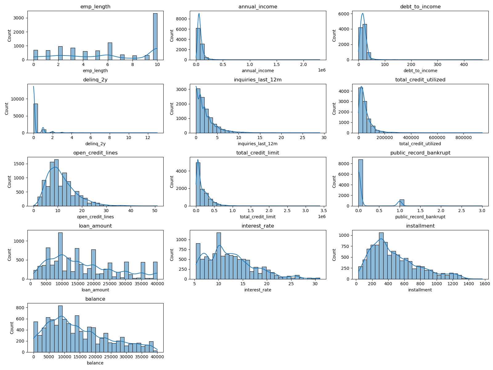
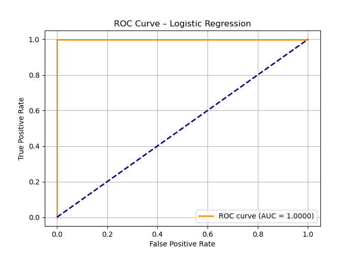

# Loan-Default-Prediction
Loan Default Prediction notebook that predicts risk and also explains why—using models like XGBoost/LightGBM and XAI tools such as SHAP (and optionally LIME)


[Notebook Link](https://github.com/Kurodataio/Loan-Default-Prediction/blob/main/loan-default-prediction.ipynb)  

---

## Table of Contents

- [Overview](#overview)  
- [Dataset](#dataset)  
- [Technologies Used](#technologies-used)  
- [Installation](#installation)  
- [Usage](#usage)  
- [Analysis & Visualizations](#analysis--visualizations)  
- [Conclusion](#conclusion)  
- [Credits](#credits)  
- [License](#license)  

---

## Overview

- Perform an exploratory data analysis of OpenIntro's Loan data from Lending Club
- The data will be imported, cleaned and basic analysis performed
- Preprocess and engineer features Handle class imbalance
- Visualizations will also be added to aid further analysis and insights
- Build models to predict risk and also explain why — using models like XGBoost/LightGBM and XAI tools such as SHAP (and optionally LIME)
- Evaluate using ROC-AUC, F1, confusion matrix

---

## Dataset

- The dataset is sourced from OpenIntro's Loan data from Lending Club.
- The dataset has 10000 rows and 55 columns/features
- One of the key features or columns of interest are the loan status and it's values
- Our **target feature value of "default" or 1 is 0.0007**, 0 or non-default is 0.9993
- The data had 7 defaults out of 10,000 loans.
- The test set had 1 default.

Dataset: loans_full_schema.csv

---

<h2>Technologies Used</h2>

<ul>
  <li><strong>Languages & Libraries:</strong> Python, Pandas, NumPy, Matplotlib, Seaborn, Scipy, sklearn</li>
  <li><strong>Tools:</strong> Jupyter Notebook, VS Code, Git, GitHub</li>
</ul>

<p>
  
  
  
  
  
  
  

</p>
<!-- <p align="left"> -->
<P>
  
    
  
  
</p>
<p>
  
</p>

---

## Installation

Step-by-step instructions to set up the project locally:

```bash

# Clone the repository
git clone https://github.com/Kurodataio/Loan-Default-Prediction.git

# Navigate to the project folder
cd Loan-Default-Prediction

# Launch Jupyter Notebook
jupyter notebook


```

## Usage

Instructions for using the project:

1. Open the main notebook (`loan-default-prediction.ipynb`)  
2. Run each cell sequentially to reproduce the analysis  
3. Visualizations and results will be generated automatically  

---

## Analysis & Visualizations 

- There were many missing values in annual_income_joint, verification_income_joint, debt_to_income_joint, months_since_last_delinq, months_since_90d_late, months_since_last_credit_inquiry
- We are interested in the 'loan_status' feature or column.
- A value of 1.0, makes the model a perfect classifier, which is unrealistic and hence invalid

- **emp_length** is how long borrowers have been employed and is right-skewed. There are more short term employed borrowers however the long term employed are the largest singular group
- **annual_income** is left-skewed. There are more low-moderate income than high income borrowers
- **debt_to_income** or DTI is left skewed. Most ratios are below 50. There are some outliers over 400.
- **delinq_2y** is the number of delinquencies in the past 2 years. Most borrowers have 0 delinquencies.
- **open_credit_lines** is the number of active credit accounts. The mean is 11.4 accounts. A moderate number of credit lines suggest prime borrowers, not high default risks.
- **total_credit_limit** is the total credit available to the borrower. Most borrowers have low limits. A small numbers of outliers have strong creditworthiness and hence high credit limits
- **public_record_bankrupt** is the borrower bankruptcy record. Very few bankruptcies, suggesting a very low risk borrower profile.
- **loan_amount** is the size of the load issued.  A slight left-skew but no clear segmentation or grouping
- **installment** is the monthly payment amount. It has left-skew with an average 476 installemnts.


---

## Conclusion 

- **We have a model severely limited by the data**
- ROC Curve (AUC = 1.0000) is not a useful predictive result

- This can be attributed to our dataset being severly imbalanced which synthetic values cannot overcome
- The EDA shows that moderate loan usage and loan sizes with low delinquencies or bankruptcies
- We can conclude that the borrower base is **low‑risk**
- The dataset has no predictive utility with the Logistic Regression model
- We could try other models, such as Random Forest and XGBoost but thwy will not overcome data limitations
- This project has been a good lesson on the fundamental importance of enough **valid data** for any predictive model

---

## Credits

<!-- - **Tutorials / References:**  -->
- **Dataset Source:** [Loan data from Lending Club - OpenIntro](https://www.openintro.org/data/index.php?data=loans_full_schema)


---

## License

This project is licensed under the [MIT License](https://choosealicense.com/licenses/mit/). 

---

